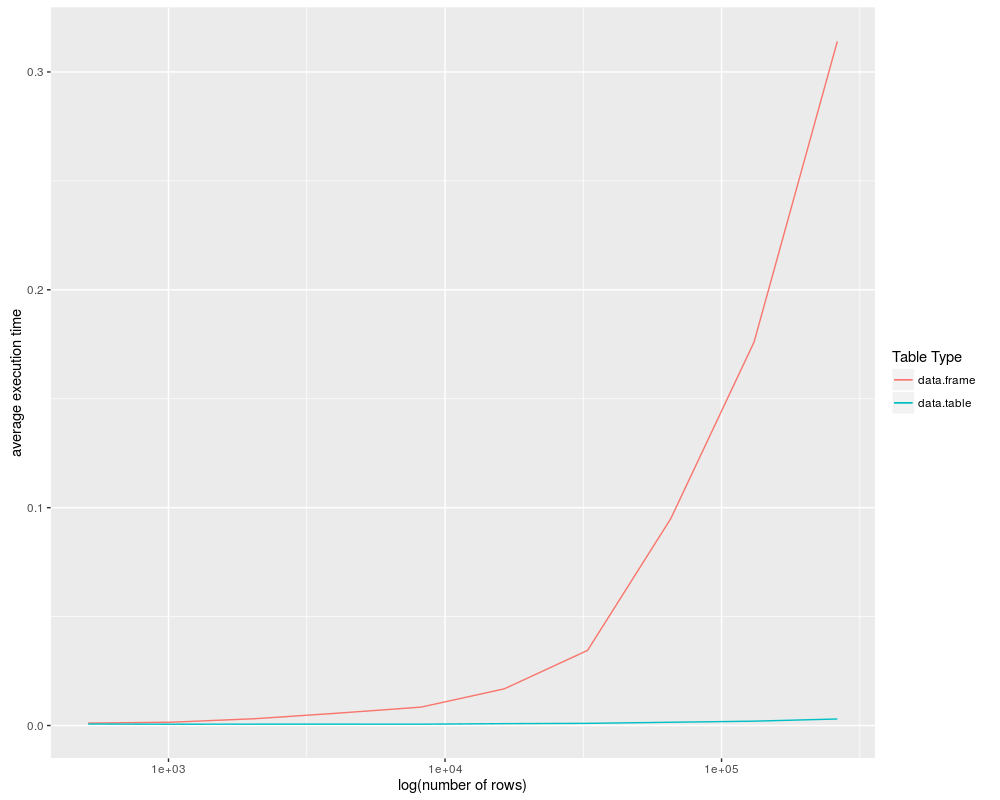

# datatable-vs-dataframe
Functions for simple benchmarking of data.frame vs data.table operations on identical inputs, with utilities for graphing the output.

Generates random integer-valued data.frames with specified numbers of rows, columns, and levels, then converts a copy to data.table with a specified number of keys.  Repeated comparable operations are then applied to both and timed.  The return value is a two-entry list containing the results in data.frame form and a ggplot plot object.

datatable_benchmark.R has a well-commented tutorial on the basics of data.tables and how to run the benchmarks.

Here is an example benchmark:
```
source("DTvsDF.R")
# setup
sizes = 10^(3:7)
sliceDF = function(df){ df[df$X1==2&df$X2==2&df$X3==2,] }
sliceDT = function(dt){ dt[.(2,2,2),] }

# the benchmark function call 
results = df_dt_benchmark(sizes = sizes,
                          df.op = sliceDF,
                          dt.op = sliceDT,
                          numcols = 10,
                          numkeys = 3,
                          numlevels = 10,
                          log_scale_x = T,
                          log_scale_y = F
                        )
```

Example output:


